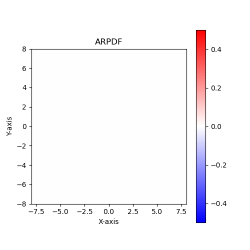
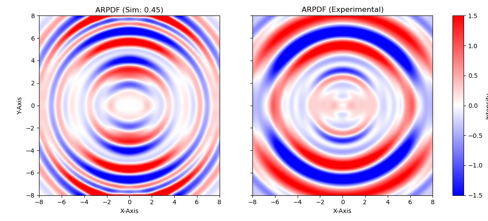

# ARPDF
- A tool for calculating the **A**ngularly **R**esolved **P**air **D**istribution **F**unction of a system of molecules.

## Introduction
ARPDF is a tool for calculating the Angularly Resolved Pair Distribution Function (ARPDF) of a system of molecules. It is written in Python and uses the `Numpy`, `Cupy`, `Scipy`, `MDAnalysis` and PyAbel libraries.

### ARPDF.py
This file contains the main tool for calculating the ARPDF. The main inputs are in type of `MDAnalysis.Universe`, which can be read from a trajectory file. The output is a 2D Numpy array of the ARPDF.

### search_boxes.py
This is the main workflow for searching the best initial structure given the trajectory file and the experimental ARPDF data.
The main inputs are the trajectory file and the experimental ARPDF data. The output contains the best initial structure and the ARPDF.
